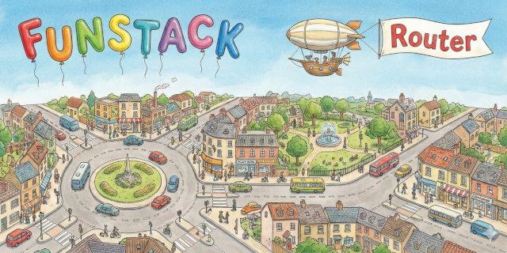

# FUNSTACK Router



A modern React router built on the [Navigation API](https://developer.mozilla.org/en-US/docs/Web/API/Navigation_API).

> **Warning**
> This project is in early development and is not ready for production use. APIs may change without notice.

## Features

- **Navigation API based** - Uses the modern Navigation API instead of the History API
- **Native `<a>` tags just work** - No special `<Link>` component needed; use standard HTML links
- **Object-based routes** - Define routes as plain JavaScript objects
- **Nested routing** - Support for layouts and nested routes with `<Outlet>`
- **Type-safe** - Full TypeScript support
- **Lightweight** - Minimal API surface

## Installation

```bash
npm install @funstack/router
```

## Development

This is a pnpm monorepo. To set up the development environment:

```bash
# Install dependencies
pnpm install

# Build the router package
pnpm build

# Run the example app
pnpm --filter funstack-router-example dev

# Run tests
pnpm test
```

### Packages

- `packages/router` - The main `@funstack/router` library
- `packages/example` - Example application

## Quick Start

```tsx
import { Router, Outlet } from "@funstack/router";
import type { RouteDefinition } from "@funstack/router";

function Layout() {
  return (
    <div>
      <nav>
        {/* Native <a> tags work for client-side navigation */}
        <a href="/">Home</a>
        <a href="/users">Users</a>
      </nav>
      <Outlet />
    </div>
  );
}

function Home() {
  return <h1>Home</h1>;
}

function Users() {
  return <h1>Users</h1>;
}

function UserDetail({ params }: { params: { id: string } }) {
  return <h1>User {params.id}</h1>;
}

const routes: RouteDefinition[] = [
  {
    path: "/",
    component: Layout,
    children: [
      { path: "", component: Home },
      { path: "users", component: Users },
      { path: "users/:id", component: UserDetail },
    ],
  },
];

function App() {
  return <Router routes={routes} />;
}
```

## API Reference

### Components

#### `<Router>`

The root component that provides routing context.

```tsx
<Router routes={routes} />
```

| Prop         | Type                 | Description                                                          |
| ------------ | -------------------- | -------------------------------------------------------------------- |
| `routes`     | `RouteDefinition[]`  | Array of route definitions                                           |
| `onNavigate` | `OnNavigateCallback` | Optional callback invoked before navigation is intercepted           |
| `fallback`   | `FallbackMode`       | Fallback mode when Navigation API is unavailable (default: `"none"`) |

#### `<Outlet>`

Renders the matched child route. Used in layout components.

```tsx
function Layout() {
  return (
    <div>
      <nav>...</nav>
      <Outlet />
    </div>
  );
}
```

### Hooks

#### `useNavigate()`

Returns a function for programmatic navigation.

```tsx
const navigate = useNavigate();

// Basic navigation
navigate("/users");

// With options
navigate("/users", { replace: true, state: { from: "home" } });
```

#### `useLocation()`

Returns the current location.

```tsx
const location = useLocation();
// { pathname: "/users", search: "?page=1", hash: "#section" }
```

#### `useParams()`

Returns the current route's path parameters. Note that route components also receive `params` as a prop, so this hook is mainly useful for non-route components that need access to params.

```tsx
// Route: /users/:id
const { id } = useParams<{ id: string }>();
```

#### `useSearchParams()`

Returns and allows updating URL search parameters.

```tsx
const [searchParams, setSearchParams] = useSearchParams();

// Read
const page = searchParams.get("page");

// Update
setSearchParams({ page: "2" });

// Update with function
setSearchParams((prev) => {
  prev.set("page", "2");
  return prev;
});
```

### Types

#### `RouteDefinition`

Route components receive a `params` prop with the matched path parameters. Use the `route()` helper for type-safe route definitions:

```typescript
import { route } from "@funstack/router";

// Route without loader - component receives params prop
route({
  path: "users/:id",
  component: UserDetail, // receives { params: { id: string } }
});

// Route with loader - component receives both data and params props
route({
  path: "users/:id",
  loader: async ({ params }) => fetchUser(params.id),
  component: UserDetail, // receives { data: Promise<User>, params: { id: string } }
});
```

You can also define routes as plain objects (without type inference):

```typescript
type RouteDefinition = {
  path: string;
  component?: React.ComponentType<{ params: Record<string, string> }>;
  children?: RouteDefinition[];
};
```

#### `Location`

```typescript
type Location = {
  pathname: string;
  search: string;
  hash: string;
};
```

#### `NavigateOptions`

```typescript
type NavigateOptions = {
  replace?: boolean;
  state?: unknown;
};
```

## Path Patterns

FUNSTACK Router uses the [URLPattern API](https://developer.mozilla.org/en-US/docs/Web/API/URLPattern) for path matching.

| Pattern      | Example        | Matches         |
| ------------ | -------------- | --------------- |
| `/users`     | `/users`       | Exact match     |
| `/users/:id` | `/users/123`   | Named parameter |
| `/files/*`   | `/files/a/b/c` | Wildcard        |

## Browser Support

The Navigation API is supported in:

- Chrome 102+
- Edge 102+
- Firefox 147+
- Safari 26.2+
- Opera 88+

## License

MIT
