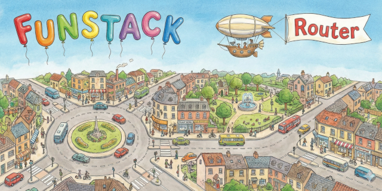

# FUNSTACK Router



A modern React router built on the [Navigation API](https://developer.mozilla.org/en-US/docs/Web/API/Navigation_API).

## Features

- **Navigation API based** - Uses the modern Navigation API (supported by Chrome, Firefox and Safari 26.2+)
- **Native `<a>` tags just work** - No special `<Link>` component needed; use standard HTML links
- **Object-based routes** - Define routes as plain JavaScript objects
- **Nested routing** - Support for layouts and nested routes with `<Outlet>`
- **Type-safe** - Full TypeScript support
- **Lightweight** - Minimal API surface
- **RSC Compatible** - Designed to work also with React Server Components

## Installation

```bash
npm install @funstack/router
```

## AI Agent Skill

FUNSTACK Router ships with an AI agent skill that gives AI coding assistants (Claude Code, Cursor, Copilot, etc.) context about the router's API and best practices. After installing the package, run the skill installer:

```bash
npx funstack-router-skill-installer
```

The installer will prompt you to choose which AI agent(s) to install the skill for. Once installed, your AI assistant will automatically have access to FUNSTACK Router documentation when working in your project.

## Development

This is a pnpm monorepo. To set up the development environment:

```bash
# Install dependencies
pnpm install

# Build the router package
pnpm build

# Run the example app
pnpm --filter funstack-router-example dev

# Run tests
pnpm test
```

### Packages

- `packages/router` - The main `@funstack/router` library
- `packages/example` - Example application
- `packages/docs` - Documentation site

## Quick Start

```tsx
import { Router, Outlet, route } from "@funstack/router";
import type { RouteDefinition, RouteComponentProps } from "@funstack/router";

function Layout() {
  return (
    <div>
      <nav>
        {/* Native <a> tags work for client-side navigation */}
        <a href="/">Home</a>
        <a href="/users">Users</a>
      </nav>
      <Outlet />
    </div>
  );
}

function Home() {
  return <h1>Home</h1>;
}

function Users() {
  return <h1>Users</h1>;
}

function UserDetail({ params }: RouteComponentProps<{ id: string }>) {
  return <h1>User {params.id}</h1>;
}

const routes: RouteDefinition[] = [
  route({
    path: "/",
    component: Layout,
    children: [
      route({ path: "", component: Home }),
      route({ path: "users", component: Users }),
      route({ path: "users/:id", component: UserDetail }),
    ],
  }),
];

function App() {
  return <Router routes={routes} />;
}
```

## API Reference

### Components

#### `<Router>`

The root component that provides routing context.

```tsx
<Router routes={routes} />
```

| Prop         | Type                 | Description                                                          |
| ------------ | -------------------- | -------------------------------------------------------------------- |
| `routes`     | `RouteDefinition[]`  | Array of route definitions                                           |
| `onNavigate` | `OnNavigateCallback` | Optional callback invoked before navigation is intercepted           |
| `fallback`   | `FallbackMode`       | Fallback mode when Navigation API is unavailable (default: `"none"`) |

#### `<Outlet>`

Renders the matched child route. Used in layout components.

```tsx
function Layout() {
  return (
    <div>
      <nav>...</nav>
      <Outlet />
    </div>
  );
}
```

### Hooks

#### `useNavigate()`

Returns a function for programmatic navigation.

```tsx
const navigate = useNavigate();

// Basic navigation
navigate("/users");

// With options
navigate("/users", { replace: true, state: { from: "home" } });
```

#### `useLocation()`

Returns the current location.

```tsx
const location = useLocation();
// { pathname: "/users", search: "?page=1", hash: "#section" }
```

#### `useRouteParams(route)`

Returns typed route parameters for a route definition created with `route()` and an `id`. The route definition is used to infer the parameter types.

```tsx
const userRoute = route({
  id: "user",
  path: "users/:userId",
  component: UserPage,
});

function UserPage() {
  const params = useRouteParams(userRoute);
  // params is typed as { userId: string }
}
```

#### `useRouteState(route)`

Returns typed navigation state for a route definition. State is tied to the navigation history entry and persists across back/forward navigation.

```tsx
type ScrollState = { scrollPos: number };
const scrollRoute = routeState<ScrollState>()({
  id: "scroll",
  path: "/scroll",
  component: ScrollPage,
});

function ScrollPage() {
  const state = useRouteState(scrollRoute);
  // state is typed as ScrollState | undefined
}
```

#### `useRouteData(route)`

Returns typed loader data for a route definition.

```tsx
const userRoute = route({
  id: "user",
  path: "users/:userId",
  loader: async ({ params }) => fetchUser(params.userId),
  component: UserPage,
});

function UserPage() {
  const data = useRouteData(userRoute);
  // data is typed based on the loader return type
}
```

#### `useSearchParams()`

Returns and allows updating URL search parameters.

```tsx
const [searchParams, setSearchParams] = useSearchParams();

// Read
const page = searchParams.get("page");

// Update
setSearchParams({ page: "2" });

// Update with function
setSearchParams((prev) => {
  prev.set("page", "2");
  return prev;
});
```

#### `useIsPending()`

Returns whether a navigation transition is currently pending.

```tsx
const isPending = useIsPending();
```

#### `useBlocker(options)`

Blocks navigation away from the current route. Useful for scenarios like unsaved form data.

Note: This hook only handles SPA navigations. For hard navigations (tab close, refresh), handle `beforeunload` separately.

```tsx
useBlocker({
  shouldBlock: () => {
    if (isDirty) {
      return !confirm("You have unsaved changes. Leave anyway?");
    }
    return false;
  },
});
```

### Route Definition Helpers

#### `route()`

Helper function for creating type-safe route definitions. Path parameters are inferred from the path pattern.

```typescript
import { route } from "@funstack/router";

// Route without loader
route({
  path: "users/:id",
  component: UserDetail, // receives RouteComponentProps<{ id: string }>
});

// Route with loader
route({
  path: "users/:id",
  loader: async ({ params, signal }) => fetchUser(params.id),
  component: UserDetail, // receives RouteComponentPropsWithData<{ id: string }, User>
});

// Route with id (enables type-safe hooks like useRouteParams)
route({
  id: "user",
  path: "users/:id",
  component: UserDetail,
});

// Pathless route (always matches, useful for layout wrappers)
route({
  component: Layout,
  children: [
    /* ... */
  ],
});
```

**Route options:**

| Option            | Type                         | Description                                                      |
| ----------------- | ---------------------------- | ---------------------------------------------------------------- |
| `path`            | `string`                     | URL path pattern (e.g., `"users/:id"`). Omit for pathless routes |
| `component`       | `ComponentType \| ReactNode` | Component to render or JSX element                               |
| `children`        | `RouteDefinition[]`          | Nested child routes                                              |
| `loader`          | `(args: LoaderArgs) => T`    | Data loader function                                             |
| `id`              | `string`                     | Route identifier for type-safe hooks                             |
| `exact`           | `boolean`                    | Override matching (default: exact for leaf, prefix for parent)   |
| `requireChildren` | `boolean`                    | Whether parent requires a child to match (default: `true`)       |

#### `routeState<TState>()`

Curried helper for creating routes with typed navigation state.

```typescript
import { routeState } from "@funstack/router";

type FilterState = { filter: string };

const productRoute = routeState<FilterState>()({
  id: "products",
  path: "products",
  loader: async () => fetchProducts(),
  component: ProductList, // receives { data, params, state: FilterState | undefined, setState, ... }
});
```

### Types

#### `RouteComponentProps`

Props passed to route components without a loader.

```typescript
interface RouteComponentProps<TParams, TState = undefined> {
  params: TParams;
  state: TState | undefined;
  setState: (
    state: TState | ((prev: TState | undefined) => TState),
  ) => Promise<void>;
  setStateSync: (
    state: TState | ((prev: TState | undefined) => TState),
  ) => void;
  resetState: () => void;
  info: unknown;
  isPending: boolean;
}
```

#### `RouteComponentPropsWithData`

Props passed to route components with a loader. Extends `RouteComponentProps` with a `data` field.

```typescript
interface RouteComponentPropsWithData<
  TParams,
  TData,
  TState = undefined,
> extends RouteComponentProps<TParams, TState> {
  data: TData;
}
```

#### `LoaderArgs`

Arguments passed to loader functions.

```typescript
type LoaderArgs<Params> = {
  params: Params;
  request: Request;
  signal: AbortSignal;
};
```

#### `Location`

```typescript
type Location = {
  pathname: string;
  search: string;
  hash: string;
};
```

#### `NavigateOptions`

```typescript
type NavigateOptions = {
  replace?: boolean;
  state?: unknown;
  info?: unknown;
};
```

## Path Patterns

FUNSTACK Router uses the [URLPattern API](https://developer.mozilla.org/en-US/docs/Web/API/URLPattern) for path matching.

| Pattern      | Example        | Matches         |
| ------------ | -------------- | --------------- |
| `/users`     | `/users`       | Exact match     |
| `/users/:id` | `/users/123`   | Named parameter |
| `/files/*`   | `/files/a/b/c` | Wildcard        |

## License

MIT
